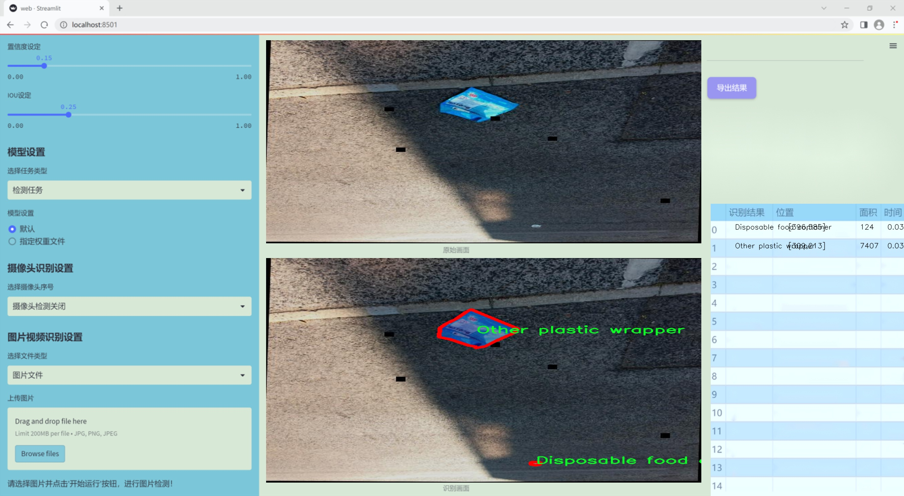
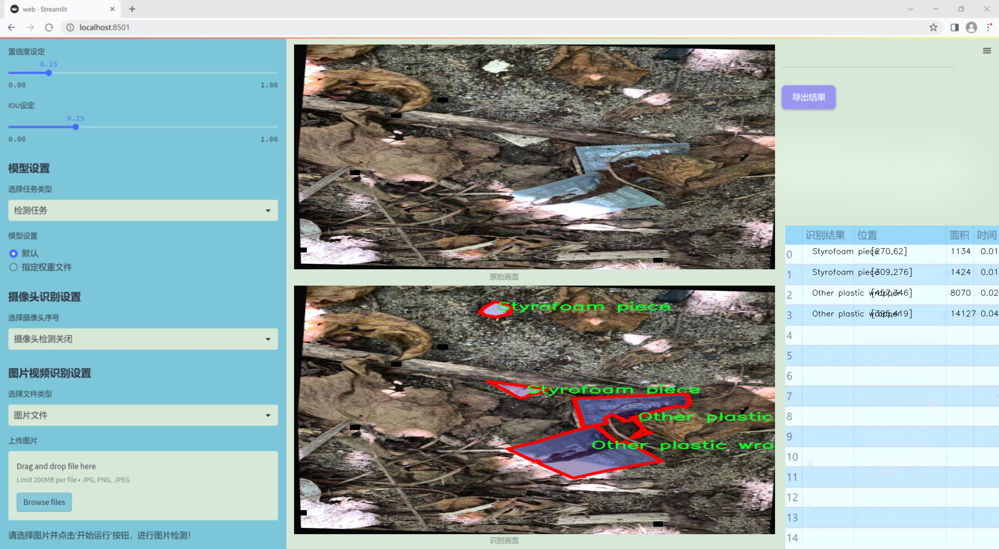
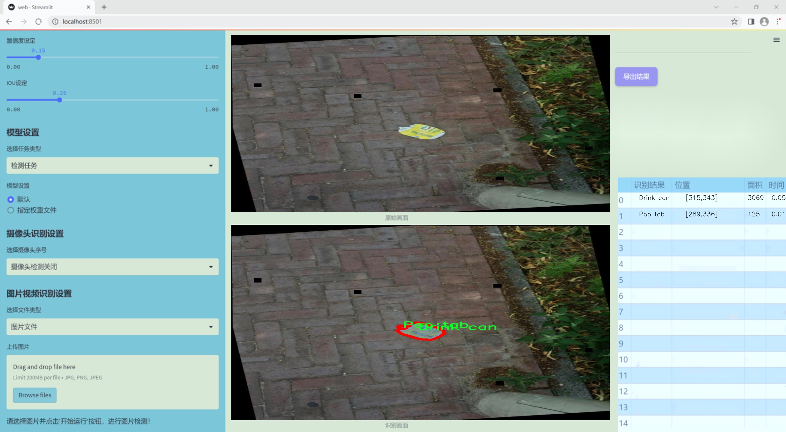
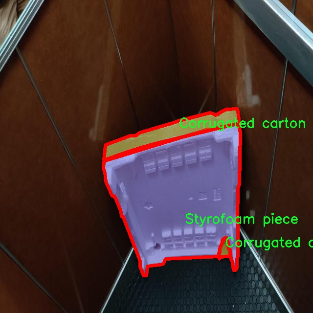
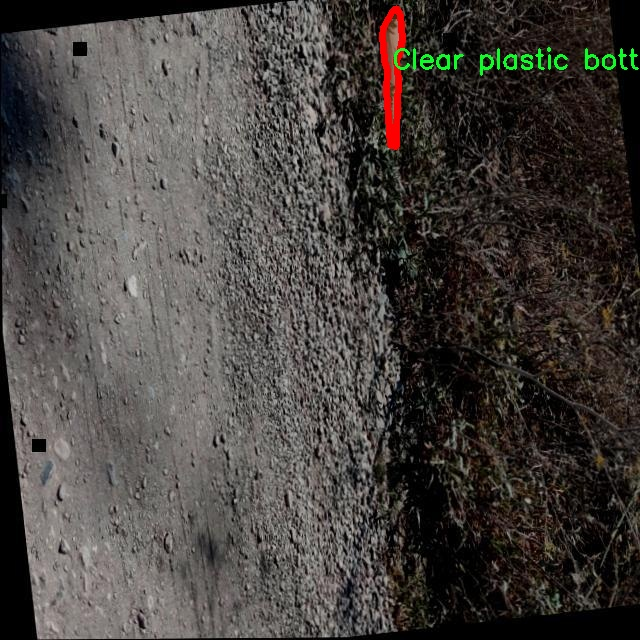
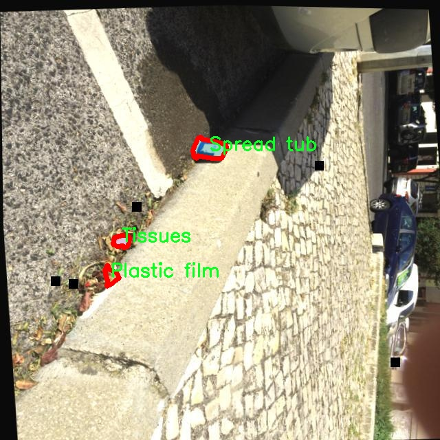
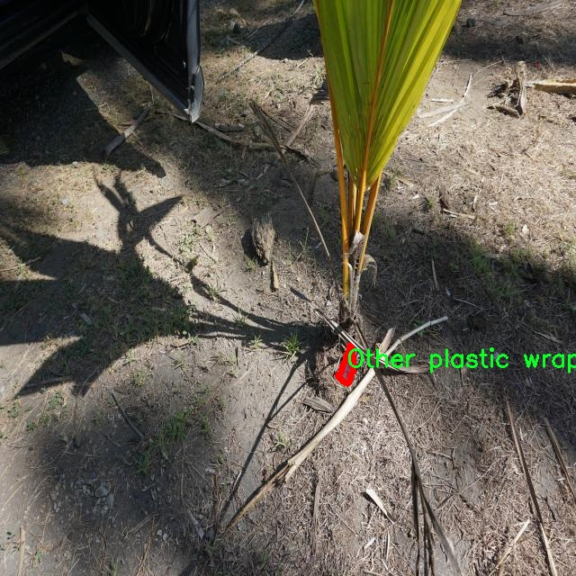
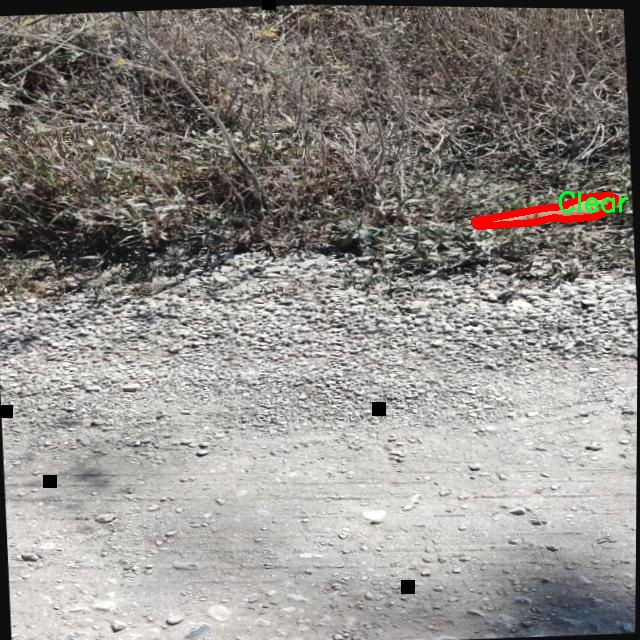

### 1.背景意义

### 研究背景与意义

随着城市化进程的加快和生活水平的提高，垃圾产生量急剧增加，环境污染问题日益严重。垃圾分类作为一种有效的垃圾管理方式，不仅有助于资源的回收利用，还能减少对环境的负面影响。然而，传统的垃圾分类方法依赖于人工识别，效率低下且容易出错。因此，开发一种高效、准确的垃圾分类检测系统显得尤为重要。

近年来，深度学习技术的迅猛发展为计算机视觉领域带来了新的机遇。YOLO（You Only Look Once）系列模型因其快速和高效的目标检测能力而受到广泛关注。YOLOv11作为该系列的最新版本，具备更强的实时检测能力和更高的准确率，能够在复杂的自然场景中有效识别和分类多种物体。基于YOLOv11的自然场景垃圾分类检测系统，将为垃圾分类提供一种智能化的解决方案。

本研究所使用的数据集TACO包含3600张图像，涵盖59种垃圾类别，包括常见的塑料瓶、纸盒、金属罐等。这些类别的多样性使得模型在训练过程中能够学习到丰富的特征，从而提高其在实际应用中的泛化能力。此外，数据集中的实例分割标注为模型提供了更为精细的训练信息，使得检测系统能够在复杂环境中更准确地定位和分类垃圾。

通过改进YOLOv11模型，结合TACO数据集的丰富信息，本研究旨在构建一个高效的自然场景垃圾分类检测系统。该系统不仅能够提高垃圾分类的准确性和效率，还将为环境保护和资源回收提供重要的技术支持，推动可持续发展的实现。

### 2.视频效果

[2.1 视频效果](https://www.bilibili.com/video/BV1ujkQYGEds/)

### 3.图片效果







##### [项目涉及的源码数据来源链接](https://kdocs.cn/l/cszuIiCKVNis)**

注意：本项目提供训练的数据集和训练教程,由于版本持续更新,暂不提供权重文件（best.pt）,请按照6.训练教程进行训练后实现上图演示的效果。

### 4.数据集信息

##### 4.1 本项目数据集类别数＆类别名

nc: 59
names: ['Aerosol', 'Aluminium blister pack', 'Aluminium foil', 'Battery', 'Broken glass', 'Carded blister pack', 'Cigarette', 'Clear plastic bottle', 'Corrugated carton', 'Crisp packet', 'Disposable food container', 'Disposable plastic cup', 'Drink can', 'Drink carton', 'Egg carton', 'Foam cup', 'Foam food container', 'Food Can', 'Food waste', 'Garbage bag', 'Glass bottle', 'Glass cup', 'Glass jar', 'Magazine paper', 'Meal carton', 'Metal bottle cap', 'Metal lid', 'Normal paper', 'Other carton', 'Other plastic', 'Other plastic bottle', 'Other plastic container', 'Other plastic cup', 'Other plastic wrapper', 'Paper bag', 'Paper cup', 'Paper straw', 'Pizza box', 'Plastic bottle cap', 'Plastic film', 'Plastic glooves', 'Plastic lid', 'Plastic straw', 'Plastic utensils', 'Polypropylene bag', 'Pop tab', 'Rope - strings', 'Scrap metal', 'Shoe', 'Single-use carrier bag', 'Six pack rings', 'Spread tub', 'Squeezable tube', 'Styrofoam piece', 'Tissues', 'Toilet tube', 'Tupperware', 'Unlabeled litter', 'Wrapping paper']


该项目为【图像分割】数据集，请在【训练教程和Web端加载模型教程（第三步）】这一步的时候按照【图像分割】部分的教程来训练

##### 4.2 本项目数据集信息介绍

本项目数据集信息介绍。本项目旨在改进YOLOv11的自然场景垃圾分类检测系统，所使用的数据集为“TACO”，该数据集专注于多种类型的垃圾物品，涵盖了59个不同的类别。这些类别包括从常见的日常垃圾到特定的包装材料，反映了现实生活中垃圾的多样性和复杂性。具体类别如气雾剂、铝箔包装、废旧电池、破碎玻璃、纸质和塑料容器等，均为我们在垃圾分类中经常遇到的物品。

数据集中的每个类别都具有其独特的特征，这使得模型在训练过程中能够学习到如何区分这些不同类型的垃圾。例如，铝箔包装和塑料容器在外观上可能相似，但它们的材质和可回收性却大相径庭。因此，准确的分类不仅有助于提高垃圾处理的效率，也能促进资源的再利用和环境保护。

此外，数据集中还包含了一些不易分类的物品，如“未标记垃圾”，这为模型的训练提供了更大的挑战，同时也增强了其在实际应用中的适应性。通过对这些多样化垃圾的识别与分类，改进后的YOLOv11模型将能够在复杂的自然场景中表现出更高的准确性和鲁棒性，从而为垃圾分类和环境保护工作提供有力支持。

总之，TACO数据集为本项目提供了丰富的训练素材，使得我们能够在实际应用中更有效地应对垃圾分类的挑战，推动可持续发展的目标。











### 5.全套项目环境部署视频教程（零基础手把手教学）

[5.1 所需软件PyCharm和Anaconda安装教程（第一步）](https://www.bilibili.com/video/BV1BoC1YCEKi/?spm_id_from=333.999.0.0&vd_source=bc9aec86d164b67a7004b996143742dc)


[5.2 安装Python虚拟环境创建和依赖库安装视频教程（第二步）](https://www.bilibili.com/video/BV1ZoC1YCEBw?spm_id_from=333.788.videopod.sections&vd_source=bc9aec86d164b67a7004b996143742dc)

### 6.改进YOLOv11训练教程和Web_UI前端加载模型教程（零基础手把手教学）

[6.1 改进YOLOv11训练教程和Web_UI前端加载模型教程（第三步）](https://www.bilibili.com/video/BV1BoC1YCEhR?spm_id_from=333.788.videopod.sections&vd_source=bc9aec86d164b67a7004b996143742dc)


按照上面的训练视频教程链接加载项目提供的数据集，运行train.py即可开始训练



     Epoch   gpu_mem       box       obj       cls    labels  img_size
     1/200     20.8G   0.01576   0.01955  0.007536        22      1280: 100%|██████████| 849/849 [14:42<00:00,  1.04s/it]
               Class     Images     Labels          P          R     mAP@.5 mAP@.5:.95: 100%|██████████| 213/213 [01:14<00:00,  2.87it/s]
                 all       3395      17314      0.994      0.957      0.0957      0.0843

     Epoch   gpu_mem       box       obj       cls    labels  img_size
     2/200     20.8G   0.01578   0.01923  0.007006        22      1280: 100%|██████████| 849/849 [14:44<00:00,  1.04s/it]
               Class     Images     Labels          P          R     mAP@.5 mAP@.5:.95: 100%|██████████| 213/213 [01:12<00:00,  2.95it/s]
                 all       3395      17314      0.996      0.956      0.0957      0.0845

     Epoch   gpu_mem       box       obj       cls    labels  img_size
     3/200     20.8G   0.01561    0.0191  0.006895        27      1280: 100%|██████████| 849/849 [10:56<00:00,  1.29it/s]
               Class     Images     Labels          P          R     mAP@.5 mAP@.5:.95: 100%|███████   | 187/213 [00:52<00:00,  4.04it/s]
                 all       3395      17314      0.996      0.957      0.0957      0.0845


###### [项目数据集下载链接](https://kdocs.cn/l/cszuIiCKVNis)

### 7.原始YOLOv11算法讲解


###### YOLOv11改进方向

与YOLOv 10相比，YOLOv 11有了巨大的改进，包括但不限于：

  * 增强的模型结构：模型具有改进的模型结构，以获取图像处理并形成预测
  * GPU优化：这是现代ML模型的反映，GPU训练ML模型在速度和准确性上都更好。
  * 速度：YOLOv 11模型现在经过增强和GPU优化以用于训练。通过优化，这些模型比它们的前版本快得多。在速度上达到了25%的延迟减少！
  * 更少的参数：更少的参数允许更快的模型，但v11的准确性不受影响
  * 更具适应性：更多支持的任务YOLOv 11支持多种类型的任务、多种类型的对象和多种类型的图像。

###### YOLOv11功能介绍

Glenn Jocher和他的团队制作了一个令人敬畏的YOLOv 11迭代，并且在图像人工智能的各个方面都提供了YOLO。YOLOv 11有多种型号，包括：

  * 对象检测-在训练时检测图像中的对象
  * 图像分割-超越对象检测，分割出图像中的对象
  * 姿态检测-当用点和线训练时绘制一个人的姿势
  * 定向检测（OBB）：类似于对象检测，但包围盒可以旋转
  * 图像分类-在训练时对图像进行分类

使用Ultralytics Library，这些模型还可以进行优化，以：

  * 跟踪-可以跟踪对象的路径
  * 易于导出-库可以以不同的格式和目的导出
  * 多场景-您可以针对不同的对象和图像训练模型

此外，Ultralytics还推出了YOLOv 11的企业模型，该模型将于10月31日发布。这将与开源的YOLOv
11模型并行，但将拥有更大的专有Ultralytics数据集。YOLOv 11是“建立在过去的成功”的其他版本的之上。

###### YOLOv11模型介绍

YOLOv 11附带了边界框模型（无后缀），实例分割（-seg），姿态估计（-pose），定向边界框（-obb）和分类（-cls）。

这些也有不同的尺寸：纳米（n），小（s），中（m），大（l），超大（x）。


YOLOv11模型

###### YOLOv11与前版本对比

与YOLOv10和YOLOv8相比，YOLOv11在Ultralytics的任何帖子中都没有直接提到。所以我会收集所有的数据来比较它们。感谢Ultralytics：

**检测：**


YOLOv11检测统计


YOLOv10检测统计

其中，Nano的mAPval在v11上为39.5，v10上为38.5；Small为47.0 vs 46.3，Medium为51.5 vs
51.1，Large为53.4 vs 53.2，Extra Large为54.7vs
54.4。现在，这可能看起来像是一种增量增加，但小小数的增加可能会对ML模型产生很大影响。总体而言，YOLOv11以0.3
mAPval的优势追平或击败YOLOv10。

现在，我们必须看看速度。在延迟方面，Nano在v11上为1.55 , v10上为1.84，Small为2.46 v2.49，Medium为4.70
v4.74，Large为6.16 v7.28，Extra Large为11.31
v10.70。延迟越低越好。YOLOv11提供了一个非常低的延迟相比，除了特大做得相当差的前身。

总的来说，Nano模型是令人振奋的，速度更快，性能相当。Extra Large在性能上有很好的提升，但它的延迟非常糟糕。

**分割：**


YOLOV11 分割统计


YOLOV9 分割统计


YOLOV8 分割数据

总体而言，YOLOv 11上的分割模型在大型和超大型模型方面比上一代YOLOv 8和YOLOv 9做得更好。

YOLOv 9 Segmentation没有提供任何关于延迟的统计数据。比较YOLOv 11延迟和YOLOv 8延迟，发现YOLOv 11比YOLOv
8快得多。YOLOv 11将大量GPU集成到他们的模型中，因此期望他们的模型甚至比CPU测试的基准更快！

姿态估计：


YOLOV11姿态估计统计


YOLOV8姿态估计统计

YOLOv 11的mAP 50 -95统计量也逐渐优于先前的YOLOv 8（除大型外）。然而，在速度方面，YOLOv
11姿势可以最大限度地减少延迟。其中一些延迟指标是版本的1/4！通过对这些模型进行GPU训练优化，我可以看到指标比显示的要好得多。

**定向边界框：**


YOLOv11 OBB统计


YOLOv8 OBB统计

OBB统计数据在mAP
50上并不是很好，只有非常小的改进，在某种程度上小于检测中的微小改进。然而，从v8到v11的速度减半，这表明YOLOv11在速度上做了很多努力。

**最后，分类：**


YOLOv 11 CLS统计


YOLOv8 CLS统计

从v8到v11，准确性也有了微小的提高。然而，速度大幅上升，CPU速度更快的型号。


### 8.200+种全套改进YOLOV11创新点原理讲解

#### 8.1 200+种全套改进YOLOV11创新点原理讲解大全

由于篇幅限制，每个创新点的具体原理讲解就不全部展开，具体见下列网址中的改进模块对应项目的技术原理博客网址【Blog】（创新点均为模块化搭建，原理适配YOLOv5~YOLOv11等各种版本）

[改进模块技术原理博客【Blog】网址链接](https://gitee.com/qunmasj/good)


#### 8.2 精选部分改进YOLOV11创新点原理讲解

###### 这里节选部分改进创新点展开原理讲解(完整的改进原理见上图和[改进模块技术原理博客链接](https://gitee.com/qunmasj/good)【如果此小节的图加载失败可以通过CSDN或者Github搜索该博客的标题访问原始博客，原始博客图片显示正常】


### OREPA：在线卷积重参数化
卷积神经网络(CNNs)已经在许多计算机视觉任务的应用成功，包括图像分类、目标检测、语义分割等。精度和模型效率之间的权衡也已被广泛讨论。

一般来说，一个精度较高的模型通常需要一个更复杂的块，一个更宽或更深的结构。然而，这样的模型总是太重，无法部署，特别是在硬件性能有限、需要实时推理的场景下。考虑到效率，更小、更紧凑和更快的模型自然是首选。

为了获得一个部署友好且高精度的模型，有研究者提出了基于结构重参数化的方法来释放性能。在这些方法中，模型在训练阶段和推理阶段有不同的结构。具体来说，使用复杂的训练阶段拓扑，即重参数化的块，来提高性能。训练结束后，通过等效变换将一个复杂的块重参为成一个单一的线性层。重参后的模型通常具有一个整洁架构模型，例如，通常是一个类似VGG的或一个类似ResNet的结构。从这个角度来看，重参化策略可以在不引入额外的推理时间成本的情况下提高模型的性能。


BN层是重构模型的关键组成部分。在一个重新解析块(图1(b))中，在每个卷积层之后立即添加一个BN层。可以观察到，去除这些BN层会导致的性能退化。然而，当考虑到效率时，这种BN层的使用出乎意料地在训练阶段带来了巨大的计算开销。在推理阶段，复杂的块可以被压缩成一个卷积层。但是，在训练过程中，BN层是非线性的，也就是说，它们将特征映射除以它的标准差，这就阻止了合并整个块。因此，存在大量的中间计算操作(large FLOPS)和缓冲特征映射(high memory usage)。更糟糕的是，这么高的训练预算使得很难探索更复杂和可能更强的重参块。很自然地，下面的问题就出现了：

为什么标准化在重参中这么重要？

通过分析和实验，作者认为BN层中的尺度因子最重要，因为它们能够使不同分支的优化方向多样化。

基于观察结果，作者提出了在线重参化(OREPA)(图1(c))，这是一个两阶段的pipeline，使之能够简化复杂的training-time re-param block。

在第一阶段，block linearization，去除所有的非线性BN层，并引入线性缩放层。这些层与BN层具有相似的性质，因此它们使不同分支的优化多样化。此外，这些层都是线性的，可以在训练过程中合并成卷积层。

第二阶段，block squeezing，将复杂的线性块简化为单一的卷积层。OREPA通过减少由中间计算层引起的计算和存储开销，显著降低了训练成本，对性能只有非常小的影响。

此外，高效化使得探索更复杂的重参化拓扑成为可能。为了验证这一点，作者进一步提出了几个重参化的组件，以获得更好的性能。

在ImageNet分类任务上评估了所提出的OREPA。与最先进的修复模型相比，OREPA将额外的训练时间GPU内存成本降低了65%到75%，并将训练过程加快了1.5-2.3倍。同时，OREPA-ResNet和OREPA-VGG的性能始终优于+0.2%∼+0.6%之前的DBB和RepVGG方法。同时作者还评估了在下游任务上的OREPA，即目标检测和语义分割。作者发现OREPA可以在这些任务上也可以带来性能的提高。

提出了在线卷积重参化(OREPA)策略，这极大地提高了重参化模型的训练效率，并使探索更强的重参化块成为可能；

通过对重参化模型工作机制的分析，用引入的线性尺度层代替BN层，这仍然提供了不同的优化方向，并保持了表示能力;

在各种视觉任务上的实验表明，OREPA在准确性和训练效率方面都优于以前的重参化模型(DBB/RepVGG)。


#### 结构重参化
结构重参化最近被重视并应用于许多计算机视觉任务，如紧凑模型设计、架构搜索和剪枝。重参化意味着不同的架构可以通过参数的等价转换来相互转换。例如，1×1卷积的一个分支和3×3卷积的一个分支，可以转移到3×3卷积的单个分支中。在训练阶段，设计了多分支和多层拓扑来取代普通的线性层(如conv或全连接层)来增强模型。Cao等讨论了如何在训练过程中合并深度可分离卷积核。然后在推理过程中，将训练时间的复杂模型转移到简单模型中，以便于更快的推理。

在受益于复杂的training-time拓扑，同时，当前的重参化方法训练使用不可忽略的额外计算成本。当块变得更复杂以变得更强的表示时，GPU内存利用率和训练时间将会越来越长，最终走向不可接受。与以往的重参化方法不同，本文更多地关注训练成本。提出了一种通用的在线卷积重参化策略，使training-time的结构重参化成为可能。


#### Normalization
BN被提出来缓解训练非常深度神经网络时的梯度消失问题。人们认为BN层是非常重要的，因为它们平滑了损失。最近关于无BN神经网络的研究声称，BN层并不是不可或缺的。通过良好的初始化和适当的正则化，可以优雅地去除BN层。

对于重参化模型，作者认为重参化块中的BN层是关键的。无BN的变体将会出现性能下降。然而，BN层是非线性的，也就是说，它们将特征图除以它的标准差，这阻止了在线合并块。为了使在线重参化可行，作者去掉了重参块中的所有BN层，并引入了BN层的线性替代方法，即线性缩放层。

#### 卷积分解
标准卷积层计算比较密集，导致大的FLOPs和参数量。因此，卷积分解方法被提出，并广泛应用于移动设备的轻量化模型中。重参化方法也可以看作是卷积分解的某种形式，但它更倾向于更复杂的拓扑结构。本文的方法的不同之处在于，在kernel-level上分解卷积，而不是在structure level。

#### 在线重参化
在本节中，首先，分析了关键组件，即重参化模型中的BN层，在此基础上提出了在线重参化(OREPA)，旨在大大减少再参数化模型的训练时间预算。OREPA能够将复杂的训练时间块简化为一个卷积层，并保持了较高的精度。

OREPA的整体pipeline如图所示，它包括一个Block Linearization阶段和一个Block Squeezing阶段。


参考该博客通过分析多层和多分支结构的优化多样性，深入研究了重参化的有效性，并证明了所提出的线性缩放层和BN层具有相似的效果。

最后，随着训练预算的减少，进一步探索了更多的组件，以实现更强的重参化模型，成本略有增加。

#### 重参化中的Normalization
作者认为中间BN层是重参化过程中多层和多分支结构的关键组成部分。以SoTA模型DBB和RepVGG为例，去除这些层会导致严重的性能下降，如表1所示。


这种观察结果也得到了Ding等人的实验支持。因此，作者认为中间的BN层对于重参化模型的性能是必不可少的。

然而，中间BN层的使用带来了更高的训练预算。作者注意到，在推理阶段，重参化块中的所有中间操作都是线性的，因此可以合并成一个卷积层，从而形成一个简单的结构。

但在训练过程中，BN层是非线性的，即它们将特征映射除以其标准差。因此，中间操作应该单独计算，这将导致更高的计算和内存成本。更糟糕的是，如此高的成本将阻止探索更强大的训练模块。

#### Block Linearization
如3.1中所述，中间的BN层阻止了在训练过程中合并单独的层。然而，由于性能问题，直接删除它们并不简单。为了解决这一困境，作者引入了channel级线性尺度操作作为BN的线性替代方法。

缩放层包含一个可学习的向量，它在通道维度中缩放特征映射。线性缩放层具有与BN层相似的效果，它们都促进多分支向不同的方向进行优化，这是重参化时性能提高的关键。除了对性能的影响外，线性缩放层还可以在训练过程中进行合并，使在线重参化成为可能。


基于线性缩放层，作者修改了重参化块，如图所示。具体来说，块的线性化阶段由以下3个步骤组成：

首先，删除了所有的非线性层，即重参化块中的BN层

其次，为了保持优化的多样性，在每个分支的末尾添加了一个缩放层，这是BN的线性替代方法

最后，为了稳定训练过程，在所有分支的添加后添加一个BN层。

一旦完成线性化阶段，在重参化块中只存在线性层，这意味着可以在训练阶段合并块中的所有组件。

#### Block Squeezing
Block Squeezing步骤将计算和内存昂贵的中间特征映射上的操作转换为更经济的kernel上的操作。这意味着在计算和内存方面从减少到，其中、是特征图和卷积核的空间尺寸。

一般来说，无论线性重参化块是多么复杂，以下2个属性始终成立：

Block中的所有线性层，例如深度卷积、平均池化和所提出的线性缩放，都可以用带有相应参数的退化卷积层来表示;

Block可以由一系列并行分支表示，每个分支由一系列卷积层组成。

有了上述两个特性，如果可以将

多层（即顺序结构）

多分支（即并行结构）

简化为单一卷积，就可以压缩一个块。在下面的部分中，将展示如何简化顺序结构(图(a))和并行结构(图(b))。


### 9.系统功能展示

图9.1.系统支持检测结果表格显示

  图9.2.系统支持置信度和IOU阈值手动调节

  图9.3.系统支持自定义加载权重文件best.pt(需要你通过步骤5中训练获得)

  图9.4.系统支持摄像头实时识别

  图9.5.系统支持图片识别

  图9.6.系统支持视频识别

  图9.7.系统支持识别结果文件自动保存

  图9.8.系统支持Excel导出检测结果数据


### 10. YOLOv11核心改进源码讲解

#### 10.1 predict.py

以下是经过精简和注释的核心代码部分：

```python
# Ultralytics YOLO 🚀, AGPL-3.0 license

from ultralytics.engine.predictor import BasePredictor
from ultralytics.engine.results import Results
from ultralytics.utils import ops

class DetectionPredictor(BasePredictor):
    """
    DetectionPredictor类，继承自BasePredictor类，用于基于检测模型进行预测。
    """

    def postprocess(self, preds, img, orig_imgs):
        """
        对预测结果进行后处理，并返回Results对象的列表。

        参数:
        preds: 模型的预测结果
        img: 输入图像
        orig_imgs: 原始图像列表

        返回:
        results: 包含处理后结果的Results对象列表
        """
        # 应用非极大值抑制（NMS）来过滤预测框
        preds = ops.non_max_suppression(
            preds,
            self.args.conf,  # 置信度阈值
            self.args.iou,   # IOU阈值
            agnostic=self.args.agnostic_nms,  # 是否使用类别无关的NMS
            max_det=self.args.max_det,  # 最大检测框数量
            classes=self.args.classes,   # 过滤特定类别
        )

        # 如果输入的原始图像不是列表，则将其转换为numpy数组
        if not isinstance(orig_imgs, list):
            orig_imgs = ops.convert_torch2numpy_batch(orig_imgs)

        results = []  # 初始化结果列表
        for i, pred in enumerate(preds):
            orig_img = orig_imgs[i]  # 获取对应的原始图像
            # 将预测框的坐标缩放到原始图像的尺寸
            pred[:, :4] = ops.scale_boxes(img.shape[2:], pred[:, :4], orig_img.shape)
            img_path = self.batch[0][i]  # 获取图像路径
            # 创建Results对象并添加到结果列表
            results.append(Results(orig_img, path=img_path, names=self.model.names, boxes=pred))
        
        return results  # 返回处理后的结果列表
```

### 代码分析：
1. **类定义**：`DetectionPredictor`类继承自`BasePredictor`，用于实现目标检测的预测功能。
2. **后处理方法**：`postprocess`方法负责对模型的预测结果进行后处理，主要包括：
   - 应用非极大值抑制（NMS）来去除冗余的预测框。
   - 将预测框的坐标缩放到原始图像的尺寸。
   - 将处理后的结果封装为`Results`对象并返回。
3. **参数说明**：
   - `preds`：模型的预测结果，通常是一个包含多个预测框的张量。
   - `img`：输入的图像，用于获取尺寸信息。
   - `orig_imgs`：原始图像，可以是一个张量或列表，后续处理时需要将其转换为numpy数组以便处理。

这个代码的核心在于如何对模型的输出进行有效的后处理，以便得到最终的检测结果。

这个文件是一个用于目标检测的预测器类，名为 `DetectionPredictor`，它继承自 `BasePredictor` 类。该类的主要功能是对输入的图像进行目标检测，并对检测结果进行后处理。

在文件的开头，首先导入了必要的模块，包括 `BasePredictor`、`Results` 和一些操作工具 `ops`。这些模块都是来自于 `ultralytics` 库，后者是一个流行的计算机视觉库，特别用于实现 YOLO（You Only Look Once）系列的目标检测模型。

`DetectionPredictor` 类中包含一个方法 `postprocess`，该方法负责对模型的预测结果进行后处理。具体来说，它接收三个参数：`preds`（模型的预测结果）、`img`（输入图像）和 `orig_imgs`（原始图像）。在方法内部，首先使用 `ops.non_max_suppression` 函数对预测结果进行非极大值抑制，以去除冗余的检测框。这一过程依赖于一些参数，如置信度阈值、IOU（Intersection Over Union）阈值、是否使用类别无关的非极大值抑制、最大检测框数量以及指定的类别。

接下来，方法检查 `orig_imgs` 是否为列表。如果不是，说明输入的图像是一个 PyTorch 张量，因此需要将其转换为 NumPy 数组格式。然后，方法会创建一个空的结果列表 `results`，用于存储每个图像的检测结果。

在随后的循环中，方法遍历每个预测结果，并将其与对应的原始图像进行配对。通过调用 `ops.scale_boxes` 函数，将预测框的坐标从当前图像的尺寸缩放到原始图像的尺寸。接着，方法获取当前图像的路径，并将原始图像、路径、模型的类别名称以及调整后的预测框封装成一个 `Results` 对象，添加到结果列表中。

最后，`postprocess` 方法返回包含所有检测结果的列表。这一过程确保了模型的输出经过合理的处理，便于后续的分析和可视化。总的来说，这个文件的核心功能是实现目标检测模型的预测和结果的后处理，方便用户在实际应用中使用。

#### 10.2 fast_kan_conv.py

以下是代码中最核心的部分，并附上详细的中文注释：

```python
import torch
import torch.nn as nn

class RadialBasisFunction(nn.Module):
    def __init__(self, grid_min: float = -2., grid_max: float = 2., num_grids: int = 8, denominator: float = None):
        super().__init__()
        # 创建一个线性空间，范围从grid_min到grid_max，包含num_grids个点
        grid = torch.linspace(grid_min, grid_max, num_grids)
        # 将grid定义为模型参数，不需要梯度更新
        self.grid = torch.nn.Parameter(grid, requires_grad=False)
        # 计算分母，如果未提供，则使用默认值
        self.denominator = denominator or (grid_max - grid_min) / (num_grids - 1)

    def forward(self, x):
        # 计算径向基函数的输出
        return torch.exp(-((x[..., None] - self.grid) / self.denominator) ** 2)

class FastKANConvNDLayer(nn.Module):
    def __init__(self, conv_class, norm_class, input_dim, output_dim, kernel_size, groups=1, padding=0, stride=1, dilation=1, ndim: int = 2, grid_size=8, base_activation=nn.SiLU, grid_range=[-2, 2], dropout=0.0):
        super(FastKANConvNDLayer, self).__init__()
        # 初始化输入和输出维度、卷积参数等
        self.inputdim = input_dim
        self.outdim = output_dim
        self.kernel_size = kernel_size
        self.padding = padding
        self.stride = stride
        self.dilation = dilation
        self.groups = groups
        self.ndim = ndim
        self.grid_size = grid_size
        self.base_activation = base_activation()
        self.grid_range = grid_range

        # 验证参数的有效性
        if groups <= 0:
            raise ValueError('groups must be a positive integer')
        if input_dim % groups != 0:
            raise ValueError('input_dim must be divisible by groups')
        if output_dim % groups != 0:
            raise ValueError('output_dim must be divisible by groups')

        # 创建基础卷积层和样条卷积层
        self.base_conv = nn.ModuleList([conv_class(input_dim // groups, output_dim // groups, kernel_size, stride, padding, dilation, groups=1, bias=False) for _ in range(groups)])
        self.spline_conv = nn.ModuleList([conv_class(grid_size * input_dim // groups, output_dim // groups, kernel_size, stride, padding, dilation, groups=1, bias=False) for _ in range(groups)])
        self.layer_norm = nn.ModuleList([norm_class(output_dim // groups) for _ in range(groups)])

        # 初始化径向基函数
        self.rbf = RadialBasisFunction(grid_range[0], grid_range[1], grid_size)

        # 初始化dropout层
        self.dropout = None
        if dropout > 0:
            if ndim == 1:
                self.dropout = nn.Dropout1d(p=dropout)
            if ndim == 2:
                self.dropout = nn.Dropout2d(p=dropout)
            if ndim == 3:
                self.dropout = nn.Dropout3d(p=dropout)

        # 使用Kaiming均匀分布初始化卷积层的权重
        for conv_layer in self.base_conv:
            nn.init.kaiming_uniform_(conv_layer.weight, nonlinearity='linear')
        for conv_layer in self.spline_conv:
            nn.init.kaiming_uniform_(conv_layer.weight, nonlinearity='linear')

    def forward_fast_kan(self, x, group_index):
        # 对输入应用基础激活函数，并进行线性变换
        base_output = self.base_conv[group_index](self.base_activation(x))
        if self.dropout is not None:
            x = self.dropout(x)
        # 计算样条基函数
        spline_basis = self.rbf(self.layer_norm[group_index](x))
        spline_basis = spline_basis.moveaxis(-1, 2).flatten(1, 2)
        # 进行样条卷积
        spline_output = self.spline_conv[group_index](spline_basis)
        # 返回基础输出和样条输出的和
        x = base_output + spline_output
        return x

    def forward(self, x):
        # 将输入分割为多个组
        split_x = torch.split(x, self.inputdim // self.groups, dim=1)
        output = []
        for group_ind, _x in enumerate(split_x):
            # 对每个组应用fast kan卷积
            y = self.forward_fast_kan(_x.clone(), group_ind)
            output.append(y.clone())
        # 将所有组的输出拼接在一起
        y = torch.cat(output, dim=1)
        return y
```

### 代码核心部分说明：
1. **RadialBasisFunction**：实现了一个径向基函数，用于计算输入与预定义网格之间的相似度。
2. **FastKANConvNDLayer**：这是一个通用的卷积层实现，支持任意维度的卷积操作。它使用基础卷积和样条卷积相结合的方式来增强特征提取能力。
3. **forward_fast_kan**：实现了对输入的前向传播，包括基础卷积和样条卷积的计算。
4. **forward**：实现了对输入的分组处理和最终输出的拼接。

通过这些核心部分，模型能够有效地进行卷积操作，并通过径向基函数增强特征提取的能力。

这个程序文件 `fast_kan_conv.py` 实现了一个基于快速径向基函数（Radial Basis Function, RBF）卷积的神经网络层，主要用于处理多维数据的卷积操作。程序中定义了几个类，其中最重要的类是 `FastKANConvNDLayer`，它是一个通用的多维卷积层，能够根据输入的维度（1D、2D、3D）进行相应的卷积操作。

首先，`RadialBasisFunction` 类定义了一个径向基函数，其构造函数接受网格的最小值、最大值、网格数量和分母参数。通过 `torch.linspace` 生成一个均匀分布的网格，并将其设置为不可训练的参数。`forward` 方法计算输入 `x` 与网格之间的距离，并通过高斯函数进行转换，输出一个基于径向基函数的结果。

接下来，`FastKANConvNDLayer` 类是核心卷积层的实现。它的构造函数接受多个参数，包括输入和输出维度、卷积核大小、分组数、填充、步幅、扩张、网格大小、基础激活函数、网格范围和丢弃率等。该类会检查分组数和输入输出维度的有效性，并初始化基础卷积层、样条卷积层、层归一化层和径向基函数。基础卷积层和样条卷积层分别使用 `conv_class` 创建，归一化层使用 `norm_class` 创建。权重使用 Kaiming 均匀分布进行初始化，以提高训练的起始效果。

`forward_fast_kan` 方法是该类的前向传播函数，首先对输入应用基础激活函数，然后进行线性变换。接着，如果设置了丢弃率，则对输入应用丢弃层。随后，计算样条基函数并进行卷积操作，最后将基础卷积输出和样条卷积输出相加，返回最终结果。

`forward` 方法将输入数据按组分割，并对每个组调用 `forward_fast_kan` 进行处理，最后将所有组的输出拼接在一起。

此外，程序还定义了三个特定维度的卷积层类：`FastKANConv1DLayer`、`FastKANConv2DLayer` 和 `FastKANConv3DLayer`，它们分别继承自 `FastKANConvNDLayer`，并在构造函数中指定了相应的卷积和归一化类。

整体来看，这个程序实现了一个灵活且高效的卷积层，能够在多维数据上应用径向基函数卷积，适用于各种深度学习任务。

#### 10.3 kagn_conv.py

以下是代码中最核心的部分，并附上详细的中文注释：

```python
import torch
import torch.nn as nn
from functools import lru_cache

class KAGNConvNDLayer(nn.Module):
    def __init__(self, conv_class, norm_class, conv_w_fun, input_dim, output_dim, degree, kernel_size,
                 groups=1, padding=0, stride=1, dilation=1, dropout: float = 0.0, ndim: int = 2):
        super(KAGNConvNDLayer, self).__init__()
        
        # 初始化参数
        self.inputdim = input_dim  # 输入维度
        self.outdim = output_dim    # 输出维度
        self.degree = degree         # 多项式的度数
        self.kernel_size = kernel_size  # 卷积核大小
        self.padding = padding       # 填充
        self.stride = stride         # 步幅
        self.dilation = dilation     # 膨胀
        self.groups = groups         # 分组卷积的组数
        self.base_activation = nn.SiLU()  # 基础激活函数
        self.conv_w_fun = conv_w_fun  # 卷积权重函数
        self.ndim = ndim             # 数据的维度（1D, 2D, 3D）
        self.dropout = None          # Dropout层

        # 根据维度选择合适的Dropout层
        if dropout > 0:
            if ndim == 1:
                self.dropout = nn.Dropout1d(p=dropout)
            elif ndim == 2:
                self.dropout = nn.Dropout2d(p=dropout)
            elif ndim == 3:
                self.dropout = nn.Dropout3d(p=dropout)

        # 验证输入和输出维度的有效性
        if groups <= 0:
            raise ValueError('groups must be a positive integer')
        if input_dim % groups != 0:
            raise ValueError('input_dim must be divisible by groups')
        if output_dim % groups != 0:
            raise ValueError('output_dim must be divisible by groups')

        # 创建基础卷积层和归一化层
        self.base_conv = nn.ModuleList([conv_class(input_dim // groups,
                                                   output_dim // groups,
                                                   kernel_size,
                                                   stride,
                                                   padding,
                                                   dilation,
                                                   groups=1,
                                                   bias=False) for _ in range(groups)])

        self.layer_norm = nn.ModuleList([norm_class(output_dim // groups) for _ in range(groups)])

        # 多项式权重的形状
        poly_shape = (groups, output_dim // groups, (input_dim // groups) * (degree + 1)) + tuple(
            kernel_size for _ in range(ndim))

        # 初始化多项式权重和beta权重
        self.poly_weights = nn.Parameter(torch.randn(*poly_shape))
        self.beta_weights = nn.Parameter(torch.zeros(degree + 1, dtype=torch.float32))

        # 使用Kaiming均匀分布初始化卷积层权重
        for conv_layer in self.base_conv:
            nn.init.kaiming_uniform_(conv_layer.weight, nonlinearity='linear')

        nn.init.kaiming_uniform_(self.poly_weights, nonlinearity='linear')
        nn.init.normal_(
            self.beta_weights,
            mean=0.0,
            std=1.0 / ((kernel_size ** ndim) * self.inputdim * (self.degree + 1.0)),
        )

    def beta(self, n, m):
        # 计算beta值，用于Legendre多项式的计算
        return (
            ((m + n) * (m - n) * n ** 2) / (m ** 2 / (4.0 * n ** 2 - 1.0))
        ) * self.beta_weights[n]

    @lru_cache(maxsize=128)  # 使用缓存避免重复计算Legendre多项式
    def gram_poly(self, x, degree):
        # 计算Legendre多项式
        p0 = x.new_ones(x.size())  # p0 = 1

        if degree == 0:
            return p0.unsqueeze(-1)

        p1 = x  # p1 = x
        grams_basis = [p0, p1]

        for i in range(2, degree + 1):
            p2 = x * p1 - self.beta(i - 1, i) * p0  # 递归计算多项式
            grams_basis.append(p2)
            p0, p1 = p1, p2

        return torch.cat(grams_basis, dim=1)  # 将所有多项式连接在一起

    def forward_kag(self, x, group_index):
        # 前向传播过程
        basis = self.base_conv[group_index](self.base_activation(x))  # 通过基础卷积层

        # 将x归一化到[-1, 1]范围内
        x = torch.tanh(x).contiguous()

        if self.dropout is not None:
            x = self.dropout(x)  # 应用Dropout

        grams_basis = self.base_activation(self.gram_poly(x, self.degree))  # 计算Gram多项式
        y = self.conv_w_fun(grams_basis, self.poly_weights[group_index],
                            stride=self.stride, dilation=self.dilation,
                            padding=self.padding, groups=1)  # 计算卷积输出

        y = self.base_activation(self.layer_norm[group_index](y + basis))  # 归一化并激活

        return y

    def forward(self, x):
        # 前向传播，处理多个组
        split_x = torch.split(x, self.inputdim // self.groups, dim=1)  # 按组分割输入
        output = []
        for group_ind, _x in enumerate(split_x):
            y = self.forward_kag(_x.clone(), group_ind)  # 处理每个组
            output.append(y.clone())
        y = torch.cat(output, dim=1)  # 将所有组的输出连接在一起
        return y
```

### 代码核心部分说明：
1. **KAGNConvNDLayer类**：这是一个自定义的卷积层，支持多维卷积（1D、2D、3D），并实现了基于Legendre多项式的卷积操作。
2. **初始化方法**：设置输入输出维度、卷积参数、激活函数等，并初始化卷积层和归一化层。
3. **beta方法**：计算用于Legendre多项式的beta值。
4. **gram_poly方法**：计算Legendre多项式的基，使用缓存来提高效率。
5. **forward_kag方法**：实现了前向传播逻辑，计算卷积输出。
6. **forward方法**：处理多个组的输入，调用`forward_kag`进行计算并合并输出。

这个程序文件 `kagn_conv.py` 定义了一系列用于卷积神经网络的层，主要是 KAGN（Kochawongwat的自适应卷积）卷积层，支持一维、二维和三维卷积。文件中包含了一个基类 `KAGNConvNDLayer` 和三个子类 `KAGNConv1DLayer`、`KAGNConv2DLayer` 和 `KAGNConv3DLayer`，分别用于处理不同维度的输入数据。

在 `KAGNConvNDLayer` 类的构造函数中，初始化了一些参数，包括输入和输出维度、卷积核大小、分组数、填充、步幅、扩张率等。该类使用了一个激活函数（SiLU）和可选的 dropout 层，以增强模型的表现。它还确保了分组数是正整数，并且输入和输出维度可以被分组数整除。

在构造函数中，创建了多个卷积层和归一化层，这些层的数量与分组数相同。每个卷积层的权重使用 Kaiming 均匀分布初始化，以便在训练开始时有更好的表现。还定义了多项式权重和 beta 权重，用于后续的多项式计算。

`beta` 方法计算与 Legendre 多项式相关的 beta 值，`gram_poly` 方法计算给定度数的 Gram 多项式，使用了缓存机制以避免重复计算。`forward_kag` 方法实现了前向传播过程，首先对输入应用基本激活函数，然后进行线性变换，接着计算 Gram 多项式，并通过卷积函数和多项式权重进行处理，最后进行归一化和激活。

`forward` 方法将输入数据按组分割，并对每个组调用 `forward_kag` 方法进行处理，最后将所有组的输出拼接在一起。

三个子类 `KAGNConv1DLayer`、`KAGNConv2DLayer` 和 `KAGNConv3DLayer` 继承自 `KAGNConvNDLayer`，分别针对一维、二维和三维卷积进行了特定的初始化，传入相应的卷积和归一化类。这使得这个模块能够灵活地处理不同维度的数据，适用于多种深度学习任务。

#### 10.4 rmt.py

以下是代码中最核心的部分，并附上详细的中文注释：

```python
import torch
import torch.nn as nn
import torch.nn.functional as F

class DWConv2d(nn.Module):
    """
    深度可分离卷积层
    """

    def __init__(self, dim, kernel_size, stride, padding):
        super().__init__()
        # 使用深度可分离卷积，groups=dim表示每个输入通道独立卷积
        self.conv = nn.Conv2d(dim, dim, kernel_size, stride, padding, groups=dim)

    def forward(self, x: torch.Tensor):
        '''
        x: 输入张量，形状为 (b, h, w, c)
        '''
        x = x.permute(0, 3, 1, 2)  # 转换为 (b, c, h, w)
        x = self.conv(x)  # 进行卷积操作
        x = x.permute(0, 2, 3, 1)  # 转换回 (b, h, w, c)
        return x


class MaSA(nn.Module):
    """
    多头自注意力机制
    """

    def __init__(self, embed_dim, num_heads, value_factor=1):
        super().__init__()
        self.factor = value_factor
        self.embed_dim = embed_dim
        self.num_heads = num_heads
        self.head_dim = self.embed_dim * self.factor // num_heads
        self.key_dim = self.embed_dim // num_heads
        self.scaling = self.key_dim ** -0.5  # 缩放因子
        # 定义线性变换层
        self.q_proj = nn.Linear(embed_dim, embed_dim, bias=True)
        self.k_proj = nn.Linear(embed_dim, embed_dim, bias=True)
        self.v_proj = nn.Linear(embed_dim, embed_dim * self.factor, bias=True)
        self.out_proj = nn.Linear(embed_dim * self.factor, embed_dim, bias=True)
        self.reset_parameters()

    def reset_parameters(self):
        # 初始化权重
        nn.init.xavier_normal_(self.q_proj.weight, gain=2 ** -2.5)
        nn.init.xavier_normal_(self.k_proj.weight, gain=2 ** -2.5)
        nn.init.xavier_normal_(self.v_proj.weight, gain=2 ** -2.5)
        nn.init.xavier_normal_(self.out_proj.weight)
        nn.init.constant_(self.out_proj.bias, 0.0)

    def forward(self, x: torch.Tensor, rel_pos):
        '''
        x: 输入张量，形状为 (b, h, w, c)
        rel_pos: 位置关系的掩码
        '''
        bsz, h, w, _ = x.size()  # 获取输入的批次大小和高度宽度

        q = self.q_proj(x)  # 计算查询
        k = self.k_proj(x)  # 计算键
        v = self.v_proj(x)  # 计算值

        k *= self.scaling  # 应用缩放因子

        # 计算注意力权重
        qk_mat = (q @ k.transpose(-1, -2)) + rel_pos  # (b, h, w, n) @ (b, h, w, n) -> (b, h, w, h*w)
        qk_mat = torch.softmax(qk_mat, -1)  # 应用softmax

        output = torch.matmul(qk_mat, v)  # 计算输出
        output = self.out_proj(output)  # 最后线性变换
        return output


class FeedForwardNetwork(nn.Module):
    """
    前馈神经网络
    """

    def __init__(self, embed_dim, ffn_dim, activation_fn=F.gelu, dropout=0.0):
        super().__init__()
        self.fc1 = nn.Linear(embed_dim, ffn_dim)  # 第一层线性变换
        self.fc2 = nn.Linear(ffn_dim, embed_dim)  # 第二层线性变换
        self.dropout = nn.Dropout(dropout)  # dropout层
        self.activation_fn = activation_fn  # 激活函数

    def forward(self, x: torch.Tensor):
        '''
        x: 输入张量，形状为 (b, h, w, c)
        '''
        x = self.fc1(x)  # 第一层
        x = self.activation_fn(x)  # 激活
        x = self.dropout(x)  # dropout
        x = self.fc2(x)  # 第二层
        return x


class VisRetNet(nn.Module):
    """
    视觉回归网络
    """

    def __init__(self, in_chans=3, num_classes=1000, embed_dims=[96, 192, 384, 768], depths=[2, 2, 6, 2], num_heads=[3, 6, 12, 24]):
        super().__init__()
        self.patch_embed = PatchEmbed(in_chans=in_chans, embed_dim=embed_dims[0])  # 图像分块嵌入
        self.layers = nn.ModuleList()  # 存储网络层
        for i_layer in range(len(depths)):
            layer = BasicLayer(embed_dim=embed_dims[i_layer], depth=depths[i_layer], num_heads=num_heads[i_layer])
            self.layers.append(layer)

    def forward(self, x):
        x = self.patch_embed(x)  # 嵌入图像
        for layer in self.layers:
            x = layer(x)  # 逐层前向传播
        return x


# 创建模型的函数
def RMT_T():
    model = VisRetNet(
        embed_dims=[64, 128, 256, 512],
        depths=[2, 2, 8, 2],
        num_heads=[4, 4, 8, 16]
    )
    return model

if __name__ == '__main__':
    model = RMT_T()  # 创建模型
    inputs = torch.randn((1, 3, 640, 640))  # 随机输入
    res = model(inputs)  # 前向传播
    print(res.size())  # 输出结果的形状
```

### 代码说明：
1. **DWConv2d**: 实现了深度可分离卷积，用于对输入特征进行卷积操作。
2. **MaSA**: 实现了多头自注意力机制，计算输入特征的注意力权重并生成输出。
3. **FeedForwardNetwork**: 实现了前馈神经网络，包含两层线性变换和激活函数。
4. **VisRetNet**: 视觉回归网络的主结构，包含图像分块嵌入和多个基本层（BasicLayer）。
5. **RMT_T**: 用于创建一个特定配置的视觉回归网络模型。

以上代码实现了一个视觉回归网络的基本结构，包含了深度可分离卷积、多头自注意力机制和前馈神经网络等组件。

这个程序文件 `rmt.py` 实现了一个基于视觉变换器（Vision Transformer）的深度学习模型，名为 VisRetNet。该模型主要用于图像处理任务，特别是在计算机视觉领域。以下是对代码的详细说明。

首先，程序导入了必要的库，包括 PyTorch 和一些特定的模块。PyTorch 是一个流行的深度学习框架，提供了构建和训练神经网络的工具。接着，定义了一些基础组件，例如深度可分离卷积（`DWConv2d`）、相对位置编码（`RelPos2d`）、多头自注意力机制（`MaSAd` 和 `MaSA`）等。这些组件是构建更复杂模型的基础。

`DWConv2d` 类实现了深度可分离卷积，允许对输入的每个通道进行独立卷积操作。`RelPos2d` 类用于生成二维的相对位置编码，这在处理图像时非常重要，因为它可以帮助模型理解像素之间的相对位置关系。`MaSAd` 和 `MaSA` 类则实现了多头自注意力机制，支持不同的注意力计算方式。

接下来，定义了 `FeedForwardNetwork` 类，它是一个前馈神经网络，通常用于 Transformer 模型中的每个层。`RetBlock` 类则是一个残差块，结合了自注意力机制和前馈网络，并支持层归一化和可选的层缩放。

`PatchMerging` 类实现了图像的下采样，通过合并多个小块来减少特征图的尺寸。`BasicLayer` 类则表示一个基本的 Transformer 层，包含多个残差块，并支持相对位置编码。

`LayerNorm2d` 类实现了二维的层归一化，适用于图像数据。`PatchEmbed` 类将输入图像划分为小块，并将这些小块嵌入到一个高维空间中，作为后续层的输入。

`VisRetNet` 类是整个模型的核心，构造了多个基本层，并在每个层之间进行特征提取和下采样。它还定义了模型的初始化权重的方法。

最后，文件中定义了几个函数（`RMT_T`、`RMT_S`、`RMT_B`、`RMT_L`），用于创建不同规模的 VisRetNet 模型。这些函数根据不同的参数配置（如嵌入维度、层数、头数等）返回相应的模型实例。

在 `__main__` 部分，程序创建了一个小型的 VisRetNet 模型，并对一个随机生成的输入进行前向传播，输出每个特征图的尺寸。这一部分主要用于测试模型的构建是否正确。

总体而言，这个程序文件展示了如何使用 PyTorch 构建一个复杂的视觉变换器模型，涵盖了从基础组件到完整模型的实现，适合用于图像分类等任务。

### 11.完整训练+Web前端界面+200+种全套创新点源码、数据集获取


# [下载链接：https://mbd.pub/o/bread/Z52Tkppr](https://mbd.pub/o/bread/Z52Tkppr)